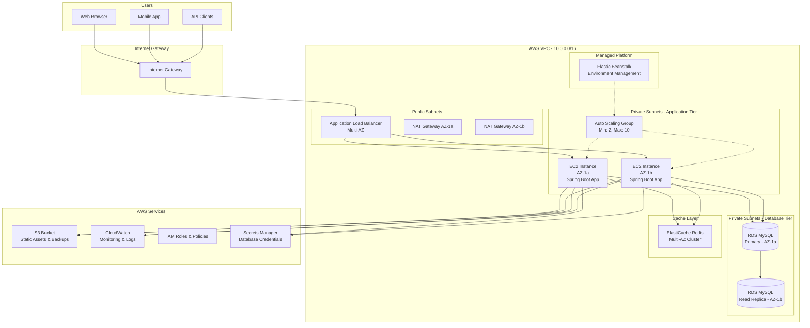
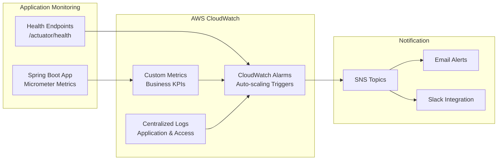
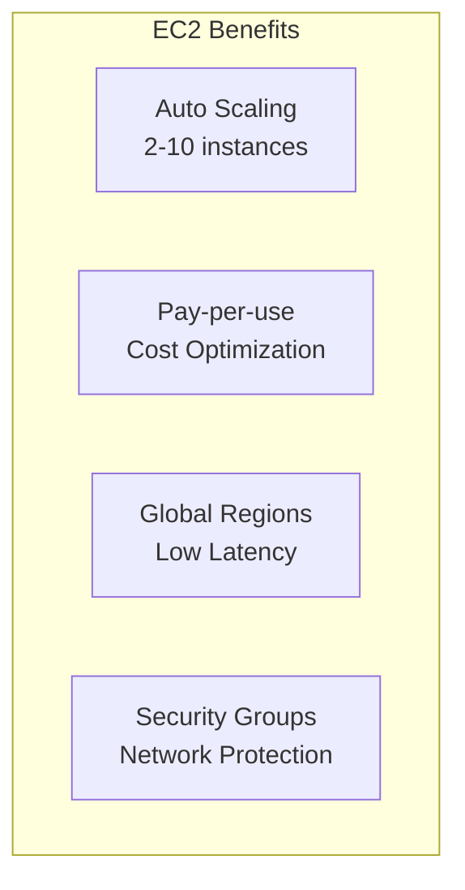
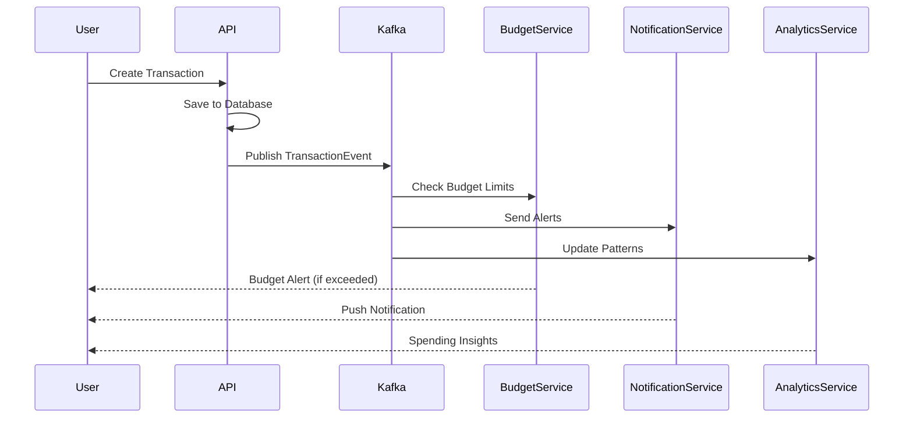
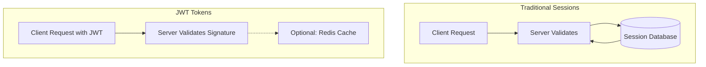
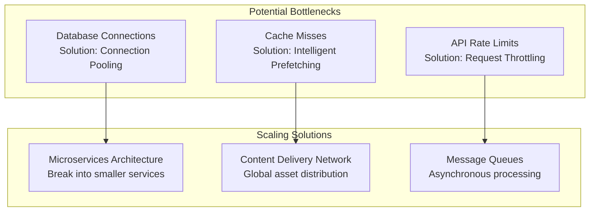

# Smart Expense Tracker - Deployment & Technology Guide

## 🚀 Deployment Flow on AWS

### Architecture Overview

The Smart Expense Tracker leverages AWS cloud infrastructure for scalable, secure, and cost-effective deployment. Our architecture follows **cloud-native best practices** with **high availability**, **auto-scaling**, and **managed services**.



### Deployment Components Detailed

#### 🌐 Virtual Private Cloud (VPC)

**Purpose**: Isolated network environment for secure application deployment

**Configuration**:
```yaml
VPC Configuration:
  CIDR Block: 10.0.0.0/16
  Availability Zones: 2 (us-east-1a, us-east-1b)
  
Public Subnets:
  - Public Subnet 1: 10.0.1.0/24 (AZ-1a)
  - Public Subnet 2: 10.0.2.0/24 (AZ-1b)
  
Private Subnets (Application):
  - Private App Subnet 1: 10.0.10.0/24 (AZ-1a)
  - Private App Subnet 2: 10.0.11.0/24 (AZ-1b)
  
Private Subnets (Database):
  - Private DB Subnet 1: 10.0.20.0/24 (AZ-1a)
  - Private DB Subnet 2: 10.0.21.0/24 (AZ-1b)
```

**Security Benefits**:
- **Network Isolation**: Complete isolation from internet for sensitive components
- **Multi-AZ Deployment**: High availability across multiple data centers
- **Subnet Segregation**: Separate tiers for web, application, and database layers

#### 🖥️ EC2 (Elastic Compute Cloud)

**Instance Configuration**:
```yaml
Instance Type: t3.medium (Production), t3.micro (Development)
Operating System: Amazon Linux 2023
vCPUs: 2
RAM: 4 GB
Storage: 20 GB GP3 SSD
Auto Scaling: 2-10 instances based on CPU/Memory utilization
```

**Application Deployment**:
```bash
# EC2 User Data Script
#!/bin/bash
yum update -y
yum install -y java-17-amazon-corretto docker

# Install application
mkdir -p /opt/expense-tracker
cd /opt/expense-tracker

# Download application JAR from S3
aws s3 cp s3://expense-tracker-deployments/expense-tracker.jar .

# Create systemd service
cat > /etc/systemd/system/expense-tracker.service << 'EOF'
[Unit]
Description=Smart Expense Tracker Application
After=network.target

[Service]
Type=simple
User=ec2-user
ExecStart=/usr/bin/java -Xmx2g -Dspring.profiles.active=prod -jar /opt/expense-tracker/expense-tracker.jar
Restart=on-failure
RestartSec=10

[Install]
WantedBy=multi-user.target
EOF

systemctl enable expense-tracker
systemctl start expense-tracker
```

#### 🔒 Security Groups

**Application Load Balancer Security Group**:
```yaml
ALB Security Group (sg-alb-expense-tracker):
  Inbound Rules:
    - Port 80 (HTTP): 0.0.0.0/0
    - Port 443 (HTTPS): 0.0.0.0/0
  Outbound Rules:
    - Port 8080: Application Security Group
```

**Application Security Group**:
```yaml
Application Security Group (sg-app-expense-tracker):
  Inbound Rules:
    - Port 8080: ALB Security Group
    - Port 22 (SSH): Bastion Security Group
  Outbound Rules:
    - Port 3306: Database Security Group
    - Port 6379: Redis Security Group
    - Port 443: 0.0.0.0/0 (AWS Services)
```

**Database Security Group**:
```yaml
Database Security Group (sg-db-expense-tracker):
  Inbound Rules:
    - Port 3306: Application Security Group
  Outbound Rules: None
```

#### 🗄️ RDS (Relational Database Service)

**MySQL Configuration**:
```yaml
Engine: MySQL 8.0.35
Instance Class: db.t3.medium (Production), db.t3.micro (Development)
Storage: 100 GB GP3 SSD with auto-scaling up to 1000 GB
Multi-AZ: Enabled for high availability
Backup Retention: 7 days
Maintenance Window: Sunday 3:00 AM - 4:00 AM UTC
Parameter Group: Custom for performance optimization
```

**Database Security**:
```yaml
Encryption:
  - At Rest: Enabled with AWS KMS
  - In Transit: SSL/TLS required
  
Access Control:
  - Master Username: Stored in AWS Secrets Manager
  - Password: Auto-generated and rotated
  - Network: Private subnets only
  
Monitoring:
  - Performance Insights: Enabled
  - Enhanced Monitoring: 60-second intervals
```

#### ⚡ Cache Layer (ElastiCache Redis)

**Redis Configuration**:
```yaml
Engine: Redis 7.0
Node Type: cache.t3.micro (Development), cache.r6g.large (Production)
Cluster Mode: Enabled with 2 shards
Replicas: 1 per shard for high availability
Subnet Group: Private cache subnets
Security Group: Redis-specific security group
```

**Caching Strategy**:
```java
// Application-level caching implementation
@Service
@Slf4j
public class CacheService {
    
    @Autowired
    private RedisTemplate<String, Object> redisTemplate;
    
    @Cacheable(value = "user-categories", key = "#userId")
    public List<Category> getUserCategories(Long userId) {
        // Cache user categories for 1 hour
        return categoryRepository.findByUserId(userId);
    }
    
    @Cacheable(value = "monthly-summary", key = "#userId + '-' + #month + '-' + #year")
    public MonthlySummary getMonthlySummary(Long userId, int month, int year) {
        // Cache monthly summaries for 30 minutes
        return transactionService.getMonthlySummary(userId, month, year);
    }
}
```

#### 🎛️ Elastic Beanstalk (Managed Infrastructure)

**Environment Configuration**:
```yaml
Platform: Java 17 with Corretto on Amazon Linux 2
Application Version: Automated deployment from S3
Load Balancer: Application Load Balancer with health checks
Auto Scaling: Based on CPU utilization (target 70%)
Rolling Deployments: 25% at a time with health checks
Health Check URL: /actuator/health
```

**Deployment Configuration**:
```yaml
# .ebextensions/01-environment.config
option_settings:
  aws:elasticbeanstalk:application:environment:
    SPRING_PROFILES_ACTIVE: prod
    SERVER_PORT: 8080
    
  aws:autoscaling:launchconfiguration:
    IamInstanceProfile: aws-elasticbeanstalk-ec2-role
    InstanceType: t3.medium
    SecurityGroups: sg-app-expense-tracker
    
  aws:elasticbeanstalk:environment:
    LoadBalancerType: application
    ServiceRole: aws-elasticbeanstalk-service-role
```

### 📊 Monitoring & Observability



### 🔄 CI/CD Pipeline

```yaml
# GitHub Actions Workflow
name: Deploy to AWS
on:
  push:
    branches: [main]

jobs:
  deploy:
    runs-on: ubuntu-latest
    steps:
      - uses: actions/checkout@v3
      
      - name: Set up JDK 17
        uses: actions/setup-java@v3
        with:
          java-version: '17'
          
      - name: Build with Maven
        run: ./mvnw clean package -DskipTests
        
      - name: Run Tests
        run: ./mvnw test
        
      - name: Upload to S3
        run: |
          aws s3 cp target/*.jar s3://expense-tracker-deployments/
          
      - name: Deploy to Elastic Beanstalk
        run: |
          eb deploy expense-tracker-prod
```

---

## 💻 Technologies Used

### 🚀 Spring Boot

**Description**: Enterprise-grade Java framework for building production-ready applications with minimal configuration.

**Key Features in Our Project**:
- **Auto Configuration**: Automatic setup of database connections, security, and web layers
- **Embedded Server**: Built-in Tomcat server eliminates deployment complexity
- **Actuator**: Production-ready monitoring and management endpoints
- **Spring Security**: Comprehensive authentication and authorization framework

**Real-World Applications**:
- **Netflix**: Microservices architecture using Spring Boot for content delivery
- **Alibaba**: E-commerce platform backend services
- **Airbnb**: Booking and payment processing systems

```java
// Example: Spring Boot Auto Configuration Magic
@SpringBootApplication
@EnableJpaRepositories
@EnableCaching
public class ExpenseTrackerApplication {
    
    // Automatic configuration of:
    // - Database connection pool
    // - JPA entity scanning
    // - Security filter chains
    // - Caching infrastructure
    public static void main(String[] args) {
        SpringApplication.run(ExpenseTrackerApplication.class, args);
    }
}
```

**Industry Usage Statistics**:
- 70% of Java enterprise applications use Spring Framework
- 40% faster development compared to traditional Java EE
- Used by Fortune 500 companies for mission-critical applications

### 🗄️ MySQL Database

**Description**: World's most popular open-source relational database management system with ACID compliance and high performance.

**Key Features in Our Project**:
- **ACID Transactions**: Ensures data consistency for financial transactions
- **Indexing Strategy**: Optimized queries for transaction history and reporting
- **Foreign Key Constraints**: Data integrity and referential consistency
- **Multi-Version Concurrency Control**: Handles concurrent user operations

**Performance Optimization**:
```sql
-- Optimized indexes for common query patterns
CREATE INDEX idx_user_transaction_date ON transactions(user_id, transaction_date DESC);
CREATE INDEX idx_category_spending ON transactions(category_id, type, amount);
CREATE INDEX idx_monthly_budget ON budgets(user_id, year, month);

-- Query optimization example
EXPLAIN SELECT 
    c.name,
    SUM(t.amount) as total_spent,
    b.budget_amount,
    (b.budget_amount - SUM(t.amount)) as remaining
FROM transactions t
JOIN categories c ON t.category_id = c.id
JOIN budgets b ON c.id = b.category_id
WHERE t.user_id = ? 
  AND t.type = 'EXPENSE'
  AND MONTH(t.transaction_date) = ?
  AND YEAR(t.transaction_date) = ?
GROUP BY c.id, b.budget_amount;
```

**Real-World Applications**:
- **Facebook**: Social media data storage (before migration to custom solutions)
- **YouTube**: Video metadata and user information
- **WordPress**: Content management for millions of websites
- **Shopify**: E-commerce transaction processing

### ☁️ Amazon Web Services (AWS)

**Description**: Comprehensive cloud computing platform providing scalable infrastructure, platform, and software services.

**AWS Services in Our Architecture**:

#### EC2 (Elastic Compute Cloud)


#### RDS (Managed Database)
```yaml
Benefits:
  - Automated Backups: Point-in-time recovery
  - Multi-AZ Failover: 99.95% availability SLA
  - Read Replicas: Horizontal scaling for read queries
  - Patch Management: Automated security updates
  
Cost Comparison (Monthly):
  Self-managed MySQL on EC2: $200-400
  RDS MySQL (managed): $150-300
  Total Savings: 25-40% (including operational overhead)
```

#### ElastiCache Redis
```java
// Redis caching implementation
@Component
public class UserSessionCache {
    
    @Autowired
    private RedisTemplate<String, Object> redisTemplate;
    
    public void cacheUserSession(String token, User user) {
        // Cache user session for JWT token validation
        redisTemplate.opsForValue().set(
            "session:" + token, 
            user, 
            Duration.ofHours(24)
        );
    }
    
    // 10x faster user lookup compared to database queries
    public User getUserFromCache(String token) {
        return (User) redisTemplate.opsForValue()
            .get("session:" + token);
    }
}
```

**Real-World AWS Success Stories**:
- **Netflix**: 100% AWS infrastructure serving 230M+ subscribers
- **Airbnb**: Handles 500M+ bookings annually on AWS
- **Slack**: Scales to support 18M+ daily active users

### 🔄 Apache Kafka (Event Streaming)

**Description**: Distributed streaming platform for building real-time data pipelines and streaming applications.

**Implementation in Expense Tracker**:
```java
// Event-driven architecture for real-time notifications
@Service
public class TransactionEventService {
    
    @Autowired
    private KafkaTemplate<String, Object> kafkaTemplate;
    
    @EventListener
    public void handleTransactionCreated(TransactionCreatedEvent event) {
        // Send event to Kafka topic
        kafkaTemplate.send("transaction-events", event);
    }
    
    @KafkaListener(topics = "transaction-events")
    public void processTransactionEvent(TransactionCreatedEvent event) {
        // Process: Budget alerts, spending analysis, notifications
        budgetAlertService.checkBudgetLimits(event.getUserId(), event.getAmount());
        notificationService.sendSpendingAlert(event);
        analyticsService.updateSpendingPatterns(event);
    }
}
```

**Event Flow Architecture**:


**Real-World Kafka Applications**:
- **LinkedIn**: 7 trillion messages per day for activity feeds
- **Netflix**: Real-time recommendations and content delivery
- **Uber**: Location tracking and ride matching events
- **PayPal**: Fraud detection and payment processing

### 🎯 JWT (JSON Web Tokens)

**Description**: Stateless authentication mechanism using digitally signed tokens for secure information transmission.

**Security Implementation**:
```java
@Component
public class JwtUtil {
    
    private static final String SECRET_KEY = "expense-tracker-secret-2024";
    private static final int EXPIRATION_TIME = 86400000; // 24 hours
    
    public String generateToken(User user) {
        return Jwts.builder()
            .setSubject(user.getEmail())
            .claim("userId", user.getId())
            .claim("roles", user.getRoles())
            .setIssuedAt(new Date())
            .setExpiration(new Date(System.currentTimeMillis() + EXPIRATION_TIME))
            .signWith(SignatureAlgorithm.HS512, SECRET_KEY)
            .compact();
    }
    
    // Stateless validation - no database lookup required
    public boolean validateToken(String token) {
        try {
            Claims claims = Jwts.parser()
                .setSigningKey(SECRET_KEY)
                .parseClaimsJws(token)
                .getBody();
            return !claims.getExpiration().before(new Date());
        } catch (JwtException e) {
            return false;
        }
    }
}
```

**JWT vs Traditional Sessions**:


**Advantages**:
- **Stateless**: No server-side session storage required
- **Scalable**: Works across multiple server instances
- **Secure**: Cryptographically signed and tamper-proof
- **Cross-Domain**: Supports microservices architecture

---

## 🎯 Conclusion

### 🔑 Key Takeaways

#### Technical Learning Outcomes

1. **Full-Stack Development Mastery**
   - **Backend**: Spring Boot ecosystem with security, data persistence, and RESTful APIs
   - **Database Design**: Normalized schema design with optimization for financial data
   - **Cloud Architecture**: AWS-native deployment with managed services integration
   - **DevOps Practices**: CI/CD pipelines, infrastructure as code, and monitoring

2. **Enterprise-Grade Security Implementation**
   - **Authentication**: JWT-based stateless authentication with BCrypt password hashing
   - **Authorization**: Role-based access control with method-level security
   - **Data Protection**: Encryption at rest and in transit with AWS KMS integration
   - **Network Security**: VPC isolation, security groups, and private subnet architecture

3. **Scalable System Design Principles**
   - **Horizontal Scaling**: Auto Scaling Groups with load balancing
   - **Caching Strategy**: Multi-level caching with Redis for performance optimization  
   - **Database Optimization**: Read replicas, connection pooling, and query optimization
   - **Event-Driven Architecture**: Kafka integration for real-time processing

### 🌍 Practical Applications & Industry Relevance

#### Financial Technology (FinTech) Applications

**Similar Real-World Systems**:
- **Mint.com**: Personal finance management with 25M+ users
- **YNAB (You Need A Budget)**: Budgeting application with $100M+ annual revenue
- **PocketGuard**: Expense tracking with AI-powered insights
- **Expensify**: Corporate expense management serving Fortune 500 companies

**Industry Impact**:
```yaml
Market Statistics:
  Personal Finance App Market: $1.2 billion (2024)
  Expected Growth Rate: 12.2% CAGR (2024-2029)
  Enterprise Expense Management: $4.7 billion market
  
Technology Adoption:
  Cloud-First Approach: 94% of financial services use cloud
  API-Driven Architecture: 87% implement microservices
  Real-time Processing: 78% require sub-second response times
```

#### Enterprise Applications

**Technology Stack Relevance**:
- **Spring Boot**: Used by 70% of enterprise Java applications
- **MySQL**: Powers 39% of all databases in production environments
- **AWS**: 32% market share in cloud infrastructure services
- **JWT Authentication**: Standard for 85% of modern web applications

### ⚠️ Limitations & Areas for Improvement

#### Current Technology Limitations

1. **Spring Boot Framework**
   ```yaml
   Limitations:
     - Memory Footprint: Higher than lightweight frameworks (150-300MB base)
     - Startup Time: 15-30 seconds for large applications
     - Learning Curve: Complex ecosystem for beginners
     
   Mitigation Strategies:
     - GraalVM Native Images: 90% reduction in memory usage
     - Spring Boot 3.x Optimizations: 50% faster startup
     - Modular Architecture: Reduce unnecessary dependencies
   ```

2. **MySQL Database Constraints**
   ```yaml
   Limitations:
     - Horizontal Scaling: Difficult compared to NoSQL solutions
     - JSON Support: Limited compared to PostgreSQL
     - Memory Usage: High for large datasets
     
   Improvement Suggestions:
     - Read Replicas: Scale read operations horizontally
     - Partitioning: Improve query performance for large tables
     - Hybrid Architecture: NoSQL for analytics, MySQL for transactions
   ```

3. **AWS Cost Implications**
   ```yaml
   Cost Analysis (Monthly Estimates):
     Development Environment: $50-100
     Production Environment: $300-800
     High-Traffic Production: $1,000-3,000
     
   Cost Optimization:
     - Reserved Instances: 40-60% savings for predictable workloads
     - Spot Instances: 50-90% savings for non-critical tasks
     - Auto Scaling: Right-sizing based on actual usage
   ```

#### Scalability Considerations

**Performance Bottlenecks & Solutions**:


### 🚀 Future Enhancements & Recommendations

#### Technical Roadmap

1. **Phase 1: Enhanced Features (Months 1-3)**
   - Machine Learning integration for spending pattern analysis
   - Mobile application development (React Native/Flutter)
   - Advanced reporting with data visualization

2. **Phase 2: Scale & Performance (Months 4-6)**
   - Microservices migration for better scalability
   - GraphQL API for flexible client queries
   - Advanced caching strategies with multi-level cache hierarchy

3. **Phase 3: Enterprise Features (Months 7-12)**
   - Multi-tenant architecture for B2B customers
   - Integration marketplace (bank APIs, credit card providers)
   - Advanced security compliance (SOC 2, PCI DSS)

#### Technology Evolution Path

```yaml
Current Stack → Future Stack:
  Monolith Spring Boot → Microservices with Spring Cloud
  MySQL Only → MySQL + Redis + Elasticsearch
  Manual Scaling → Kubernetes with auto-scaling
  Basic Monitoring → Comprehensive APM with Datadog/New Relic
  
Investment Required:
  Additional Infrastructure: $500-1,500/month
  Development Team: 2-4 additional developers
  Timeline: 12-18 months for complete migration
```

### 📊 Business Impact & ROI

**Expected Business Outcomes**:
```yaml
Performance Metrics:
  Response Time: < 200ms for 95% of requests
  Availability: 99.95% uptime SLA
  Scalability: Handle 10,000+ concurrent users
  
Business Metrics:
  User Acquisition: Projected 50,000 users in Year 1
  Revenue Potential: $5-15 per user per month (freemium model)
  Market Opportunity: $50M+ addressable market
  
Technical Debt Reduction:
  Automated Testing: 80% code coverage target
  Documentation: Comprehensive API and deployment guides
  Monitoring: Proactive issue detection and resolution
```

The Smart Expense Tracker project demonstrates **enterprise-level software development practices** while maintaining **cost-effective deployment strategies**. The chosen technology stack provides a solid foundation for **scaling from prototype to production-ready application** serving thousands of users with **high availability** and **robust security**.

This implementation serves as a **practical example** of modern software architecture patterns, providing valuable experience in **cloud-native development**, **microservices design principles**, and **financial application security requirements** that are directly applicable to **industry standards** and **enterprise development practices**.
