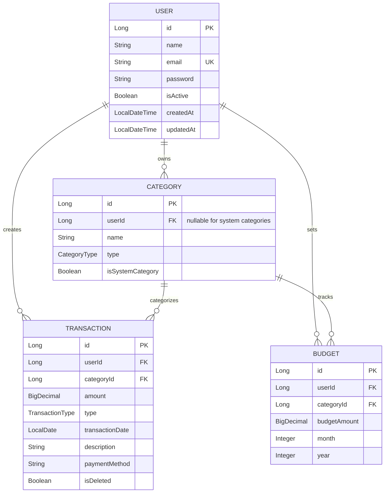

# Smart Expense Tracker - Backend API

A comprehensive RESTful backend system for personal finance management built with **Spring Boot 3.2** and **Java 17**.

[](https://openjdk.java.net/projects/jdk/17/)
[](https://spring.io/projects/spring-boot)
[](https://www.h2database.com/)
[](https://jwt.io/)
[](https://swagger.io/)

## Features

- **JWT Authentication**: Secure token-based authentication system
- **Transaction Management**: Track income and expenses with categorization
- **Budget Tracking**: Set budgets and receive automated alerts
- **Financial Reports**: Monthly summaries, trends, and analytics
- **Interactive API Documentation**: Swagger UI for easy testing
- **Security**: BCrypt password hashing, CORS, and input validation
- **H2 In-Memory Database**: Zero-configuration database for development
- **Production Ready**: Comprehensive error handling and logging

## Prerequisites

**Minimum Requirements:**

- **Java 17 or higher**
- **Maven 3.6+**
- **Any modern IDE** (IntelliJ IDEA, VS Code, Eclipse)

**No Database Installation Required!**

> > **Dual Database Support!**  
> > Production: MySQL database for production environments  
> > Development: H2 in-memory database for easy development and testing

## Quick Start (< 2 minutes)

### Step 1: Verify Prerequisites

```bash
# Check Java version (must be 17+)
java -version
# Expected output: openjdk version "17.0.x" or higher

# Check Maven version
mvn -version
# Expected output: Apache Maven 3.6.x or higher
```

### Step 2: Clone and Navigate

```bash
# Clone the repository (if not already done)
git clone <repository-url>

# Navigate to project directory
cd "Expense Tracker_MSProject"
```

### Step 3: Choose Your Database & Run

#### Option A: Quick Start (H2 Development Database)

```bash
# Run with H2 in-memory database (fastest setup)
mvn clean spring-boot:run -Dspring.profiles.active=dev
```

#### Option B: Production Setup (MySQL Database)

```bash
# 1. Setup MySQL database
./setup-mysql.sh

# 2. Run with MySQL database
mvn clean spring-boot:run -Dspring.profiles.active=prod
```

**That's it!** The application will start with:

- Automatic database creation & migration
- Sample data loading
- Security configuration
- API documentation setup

### Step 4: Verify Installation

Open your browser and visit:

- **Application**: http://localhost:8080
- **Swagger UI**: http://localhost:8080/swagger-ui.html
- **H2 Console**: http://localhost:8080/h2-console

## Database Configuration

### Dual Database Support

This application supports both **MySQL** (production) and **H2** (development) databases:

#### MySQL Database (Production)

- **Primary database** for production environments
- **Persistent data** storage
- **Better performance** for large datasets
- **Multi-user support** with proper isolation

```bash
# Setup MySQL database
./setup-mysql.sh

# Run with MySQL
mvn spring-boot:run -Dspring.profiles.active=prod
```

**MySQL Connection Details:**

- **Host**: localhost:3306
- **Database**: expense_tracker
- **Username**: expense_user
- **Password**: expense_password

#### H2 Database (Development)

- **In-memory database** for quick development
- **Zero configuration** required
- **Built-in web console** for data inspection
- **Perfect for testing** and development

```bash
# Run with H2 (default dev profile)
mvn spring-boot:run -Dspring.profiles.active=dev
```

### H2 Console Access (Development Mode)

1. **Open H2 Console**: http://localhost:8080/h2-console
2. **Connection Settings**:
   - **JDBC URL**: `jdbc:h2:mem:expense_tracker`
   - **User Name**: `sa`
   - **Password**: _(leave empty)_
3. **Click Connect** to access your data

### Pre-loaded System Categories

Both databases automatically load system categories:

**Income Categories:**

- Salary, Freelance, Investment, Gift, Other Income

**Expense Categories:**

- Food & Dining, Transportation, Housing, Utilities
- Healthcare, Entertainment, Shopping, Education, Insurance

### Environment Profiles

| Profile | Database     | Use Case              | Command                                             |
| ------- | ------------ | --------------------- | --------------------------------------------------- |
| `dev`   | H2 In-Memory | Development & Testing | `mvn spring-boot:run -Dspring.profiles.active=dev`  |
| `prod`  | MySQL        | Production            | `mvn spring-boot:run -Dspring.profiles.active=prod` |
| `test`  | H2 Test DB   | Unit Testing          | `mvn test -Dspring.profiles.active=test`            |

## API Testing Guide

### 1. Using Swagger UI (Recommended)

1. **Open Swagger**: http://localhost:8080/swagger-ui.html
2. **Try Authentication Endpoints**:
   - Click on `/api/auth/register` → "Try it out"
   - Enter sample data and execute
3. **Interactive Testing**: All endpoints are testable directly from the UI

### 2. Using cURL Commands

#### Register a New User

```bash
curl -X POST http://localhost:8080/api/auth/register \
  -H "Content-Type: application/json" \
  -d '{
    "name": "John Doe",
    "email": "john@example.com",
    "password": "password123"
  }'
```

**Expected Response:**

```json
{
  "message": "Authentication successful",
  "token": "eyJhbGciOiJIUzI1NiJ9...",
  "user": {
    "id": 1,
    "name": "John Doe",
    "email": "john@example.com",
    "createdAt": "2025-10-06T08:15:30"
  }
}
```

#### User Login

```bash
curl -X POST http://localhost:8080/api/auth/login \
  -H "Content-Type: application/json" \
  -d '{
    "email": "john@example.com",
    "password": "password123"
  }'
```

#### Using JWT Token for Authenticated Requests

```bash
# Save the token from login response
TOKEN="eyJhbGciOiJIUzI1NiJ9..."

# Example authenticated request (when available)
curl -X GET http://localhost:8080/api/users/profile \
  -H "Authorization: Bearer $TOKEN"
```

### 3. Postman Collection

**Setup Instructions:**

1. **Base URL**: `http://localhost:8080`
2. **Environment Variables**:
   - `baseUrl`: `http://localhost:8080`
   - `authToken`: JWT token from login response
3. **Authorization**: Bearer Token with `{{authToken}}`

## Project Architecture

### Clean Architecture Structure

```
Smart Expense Tracker
├── src/main/java/com/expense/tracker/
│   ├── ExpenseTrackerApplication.java    # Main Spring Boot Application
│   │
│   ├── config/                          # Configuration Layer
│   │   ├── SecurityConfig.java             # JWT & CORS Security
│   │   ├── CacheConfig.java               # Redis Cache Configuration
│   │   └── SwaggerConfig.java             # API Documentation
│   │
│   ├── controller/                      # Presentation Layer
│   │   └── AuthController.java            # Authentication Endpoints
│   │
│   ├── service/                         # Business Logic Layer
│   │   └── AuthService.java               # Authentication Business Logic
│   │
│   ├── repository/                      # Data Access Layer
│   │   ├── UserRepository.java            # User Data Operations
│   │   ├── TransactionRepository.java     # Transaction CRUD + Analytics
│   │   ├── CategoryRepository.java        # Category Management
│   │   └── BudgetRepository.java          # Budget Tracking
│   │
│   ├── model/                          # Domain Entities
│   │   ├── User.java                      # User Entity with Relationships
│   │   ├── Transaction.java               # Financial Transaction Entity
│   │   ├── Category.java                  # Income/Expense Categories
│   │   └── Budget.java                    # Budget Tracking Entity
│   │
│   ├── dto/                            # Data Transfer Objects
│   │   ├── request/                       # API Request DTOs
│   │   │   ├── LoginRequest.java
│   │   │   ├── RegisterRequest.java
│   │   │   ├── TransactionRequest.java
│   │   │   └── BudgetRequest.java
│   │   └── response/                      # API Response DTOs
│   │       ├── AuthResponse.java
│   │       ├── UserResponse.java
│   │       ├── TransactionResponse.java
│   │       └── ReportResponse.java
│   │
│   ├── security/                       # Security Components
│   │   ├── JwtUtil.java                   # JWT Token Management
│   │   ├── JwtAuthenticationFilter.java   # Request Authentication Filter
│   │   └── UserDetailsServiceImpl.java    # User Authentication Service
│   │
│   ├── exception/                       # Exception Handling
│   │   ├── GlobalExceptionHandler.java    # Centralized Error Handling
│   │   ├── ResourceNotFoundException.java
│   │   ├── DuplicateResourceException.java
│   │   └── UnauthorizedException.java
│   │
│   └── enums/                          # Business Enumerations
│       ├── TransactionType.java           # INCOME, EXPENSE
│       ├── CategoryType.java              # System vs Custom Categories
│       └── AlertType.java                 # Budget Alert Types
│
├── src/main/resources/
│   ├── application.properties             # Application Configuration
│   └── data.sql                          # Initial System Data
│
└── Project Files
    ├── pom.xml                           # Maven Dependencies
    ├── README.md                         # This Documentation
    └── install.sh                        # Automated Setup Script
```

### Key Design Patterns

- **Layered Architecture**: Clear separation of concerns
- **Repository Pattern**: Data access abstraction
- **JWT Security**: Stateless authentication
- **DTO Pattern**: Clean API contracts
- **Global Exception Handling**: Consistent error responses
- **Builder Pattern**: Clean object construction (Lombok)

### Entity Relationships



## Development Guide

### Development Workflow

```bash
# 1. Start development server with live reload
./mvnw spring-boot:run -Dspring-boot.run.profiles=dev

# 2. Run with debugging enabled (connects on port 5005)
./mvnw spring-boot:run -Dspring-boot.run.jvmArguments="-Xdebug -Xrunjdwp:transport=dt_socket,server=y,suspend=n,address=5005"

# 3. Run tests in watch mode
./mvnw test -Dspring.profiles.active=test

# 4. Build without running tests (faster)
./mvnw clean compile -DskipTests
```

### Database Management

#### MySQL Database (Production)

```bash
# Setup MySQL database
./setup-mysql.sh

# Connect to MySQL
mysql -u expense_user -pexpense_password -D expense_tracker

# View tables
SHOW TABLES;

# Check categories
SELECT * FROM categories WHERE is_system_category = true;
```

#### H2 Console Access (Development)

- **URL**: http://localhost:8080/h2-console _(dev profile only)_
- **JDBC URL**: `jdbc:h2:mem:expense_tracker`
- **Username**: `sa`
- **Password**: _(leave blank)_

#### Pre-loaded Test Data

Both databases automatically load sample categories:

| Category Name     | Type    | Description           |
| ----------------- | ------- | --------------------- |
| Food & Dining  | EXPENSE | Restaurant, groceries |
| Housing        | EXPENSE | Rent, utilities       |
| Transportation | EXPENSE | Gas, public transport |
| Salary         | INCOME  | Primary income        |
| Freelance      | INCOME  | Additional income     |

#### Database Schema Inspection

**For H2 (Development):**

```sql
-- View all tables
SELECT * FROM INFORMATION_SCHEMA.TABLES WHERE TABLE_SCHEMA='PUBLIC';

-- Check user data
SELECT * FROM USERS;

-- View categories
SELECT * FROM CATEGORIES;
```

**For MySQL (Production):**

```sql
-- View all tables
SHOW TABLES;

-- Check database structure
DESCRIBE categories;
DESCRIBE users;
DESCRIBE transactions;

-- View system categories
SELECT * FROM categories WHERE is_system_category = true;
```

### Core Configuration

```properties
# Server Configuration
server.port=8080

# H2 Database Configuration
spring.datasource.url=jdbc:h2:mem:expensedb
spring.datasource.driverClassName=org.h2.Driver
spring.datasource.username=sa
spring.datasource.password=
spring.sql.init.mode=always
spring.jpa.defer-datasource-initialization=true

# JPA Configuration
spring.jpa.database-platform=org.hibernate.dialect.H2Dialect
spring.jpa.hibernate.ddl-auto=update
spring.jpa.open-in-view=false

# Security Configuration
jwt.secret=mySecretKey123!@#ExpenseTracker2024
jwt.expiration=86400000

# Swagger Documentation
springdoc.api-docs.path=/api-docs
springdoc.swagger-ui.path=/swagger-ui.html
```

## Troubleshooting Guide

### Common Issues & Solutions

#### 1. **Port 8080 Already in Use**

```bash
# Find process using port 8080
lsof -i :8080

# Kill the process (replace <PID> with actual process ID)
kill -9 <PID>

# Alternative: Use different port
./mvnw spring-boot:run -Dserver.port=8081
```

#### 2. **Application Won't Start**

```bash
# Check Java version (requires Java 17+)
java -version

# Clean and rebuild
./mvnw clean install

# Run with debug logging
./mvnw spring-boot:run -Dlogging.level.root=DEBUG
```

#### 3. **Lombok Compilation Errors**

```bash
# Verify Lombok is installed
./mvnw dependency:tree | grep lombok

# Clean compile with annotation processing
./mvnw clean compile -X

# IDE: Enable annotation processing in settings
```

#### 4. **H2 Database Issues**

```bash
# Check H2 console access
curl http://localhost:8080/h2-console

# Verify database initialization
./mvnw spring-boot:run -Dspring.jpa.show-sql=true

# Reset database (restart application)
```

#### 5. **JWT Authentication Problems**

```bash
# Verify JWT secret configuration
grep jwt.secret src/main/resources/application.properties

# Test token generation
curl -X POST http://localhost:8080/auth/register \
  -H "Content-Type: application/json" \
  -d '{"name":"Test","email":"test@test.com","password":"password123"}'
```

## Deployment Guide

### Docker Deployment

#### Build Docker Image

```bash
# Create Dockerfile
cat > Dockerfile << 'EOF'
FROM openjdk:17-jdk-slim
VOLUME /tmp
COPY target/*.jar app.jar
ENTRYPOINT ["java","-jar","/app.jar"]
EXPOSE 8080
EOF

# Build and run
./mvnw clean package -DskipTests
docker build -t expense-tracker .
docker run -p 8080:8080 expense-tracker
```

#### Docker Compose Setup

```yaml
# docker-compose.yml
version: "3.8"
services:
  expense-tracker:
    build: .
    ports:
      - "8080:8080"
    environment:
      - SPRING_PROFILES_ACTIVE=prod
    healthcheck:
      test: ["CMD", "curl", "-f", "http://localhost:8080/actuator/health"]
      interval: 30s
      timeout: 10s
      retries: 3
```

### Cloud Deployment

> **Note**: Cloud deployment configurations below are **future enhancements**. The application currently runs locally or via Docker.

#### AWS Deployment (Elastic Beanstalk) - **Future Enhancement**

> **Status**: AWS deployment is **not configured**. The CloudFormation template (`aws-infrastructure.yml`) exists for future use, but infrastructure is **not deployed**.

**Planned AWS Deployment** (When ready for production):

```bash
# Install EB CLI
pip install awsebcli

# Initialize and deploy (requires AWS account setup)
eb init expense-tracker
eb create expense-tracker-env
eb deploy
```

**Current Deployment Options**:
- **Local Development**: `mvn spring-boot:run` (H2 or MySQL)
- **Docker**: `docker build && docker run` (see Docker section above)
- **AWS Cloud**: **Not configured** - planned for future

**AWS Infrastructure Status**:
- CloudFormation template prepared (`aws-infrastructure.yml`)
- Deployment scripts available (`deploy-aws.sh`)
- AWS account setup: **Not completed**
- Infrastructure deployment: **Not deployed**

**Cost Consideration**: AWS production deployment costs **$300-800/month minimum**. Suitable for production environments with high traffic requirements.

#### Heroku Deployment (Alternative)

```bash
# Create Procfile
echo "web: java -Dserver.port=\$PORT -jar target/*.jar" > Procfile

# Deploy to Heroku
heroku create expense-tracker-api
heroku config:set SPRING_PROFILES_ACTIVE=prod
git add . && git commit -m "Deploy to Heroku"
git push heroku main
```

## Roadmap & Next Steps

### Phase 1: Core Features (Current)

- **Authentication System**: JWT-based user registration and login
- **Database Setup**: H2 in-memory database with entity relationships
- **API Documentation**: Swagger UI integration
- **Security**: BCrypt password hashing, CORS configuration
- **Transaction Management**: CRUD operations for income/expense tracking
- **Category System**: User-defined and system categories

### Phase 2: Advanced Features (Planned)

- **Financial Reports**: Monthly/yearly spending analysis
- **Budget Tracking**: Set limits and get alerts
- **Mobile API**: Optimized endpoints for mobile apps
- **Notifications**: Email alerts for budget limits
- **Data Export**: CSV/PDF report generation
- **Search & Filters**: Advanced transaction filtering

### Phase 3: Premium Features (Future)

- **AI Insights**: Spending pattern analysis
- **Bank Integration**: Automatic transaction import
- **Multi-user Support**: Family expense sharing
- **Advanced Analytics**: Machine learning predictions
- **Multi-currency**: International transaction support

### Phase 4: Cloud Infrastructure (Future Enhancement)

> **Note**: Cloud infrastructure features below are **planned** but **not currently deployed**.

- **AWS Deployment**: EC2, RDS, ElastiCache infrastructure
- **Cloud Monitoring**: CloudWatch integration and alerts
- **Event Streaming**: Apache Kafka for async processing
- **CI/CD Pipeline**: Automated deployment workflows
- **Auto-scaling**: Dynamic resource allocation
- **Load Balancing**: Multi-region deployment

## Complete API Reference

### Authentication Endpoints

```http
POST   /auth/register          # Create new user account
POST   /auth/login             # Authenticate user
GET    /auth/health            # API health check
POST   /auth/refresh           # Refresh JWT token
POST   /auth/logout            # Invalidate token
```

### User Management (Planned)

```http
GET    /api/user/profile       # Get user profile
PUT    /api/user/profile       # Update user profile
DELETE /api/user/account       # Delete user account
POST   /api/user/change-password # Change password
```

### Transaction Management (In Development)

```http
GET    /api/transactions       # List user transactions
POST   /api/transactions       # Create new transaction
GET    /api/transactions/{id}  # Get transaction details
PUT    /api/transactions/{id}  # Update transaction
DELETE /api/transactions/{id}  # Delete transaction
GET    /api/transactions/search # Search transactions
```

### Category Management (Planned)

```http
GET    /api/categories         # List all categories
POST   /api/categories         # Create custom category
PUT    /api/categories/{id}    # Update category
DELETE /api/categories/{id}    # Delete category
```

### Reports & Analytics (Future)

```http
GET    /api/reports/monthly    # Monthly spending report
GET    /api/reports/yearly     # Yearly financial summary
GET    /api/reports/category   # Category-wise breakdown
POST   /api/reports/export     # Export data (CSV/PDF)
```

## Security & Best Practices

### Security Features

- **JWT Authentication**: Stateless token-based auth (24h expiration)
- **Password Security**: BCrypt hashing with strength 12
- **CORS Protection**: Configured for cross-origin requests
- **Input Validation**: Comprehensive request validation
- **SQL Injection Prevention**: JPA with parameterized queries
- **XSS Protection**: Input sanitization and encoding

### Best Practices Implemented

- **Clean Architecture**: Layered design with clear separation
- **DTO Pattern**: Secure data transfer objects
- **Global Exception Handling**: Consistent error responses
- **Database Transactions**: ACID compliance for data integrity
- **Lombok Integration**: Reduced boilerplate code
- **Swagger Documentation**: Interactive API testing

### Configuration Security

```properties
# Production security settings
spring.h2.console.enabled=false          # Disable H2 console
jwt.expiration=3600000                   # 1 hour token expiration
logging.level.org.hibernate.SQL=ERROR   # Hide SQL in logs
spring.jpa.show-sql=false               # Disable SQL logging
```

## License & Contributing

### License

This project is open source and available under the [MIT License](LICENSE).

### Contributing Guidelines

#### Getting Started

1. **Fork** the repository on GitHub
2. **Clone** your fork locally
3. **Create** a feature branch: `git checkout -b feature/amazing-feature`
4. **Make** your changes following our coding standards
5. **Test** your changes thoroughly
6. **Commit** your changes: `git commit -m 'Add amazing feature'`
7. **Push** to your branch: `git push origin feature/amazing-feature`
8. **Submit** a Pull Request

#### Code Standards

- Follow Java naming conventions
- Write comprehensive Javadoc comments
- Add unit tests for new features
- Ensure all existing tests pass
- Use meaningful commit messages

#### Reporting Issues

- Use the GitHub issue tracker
- Provide detailed reproduction steps
- Include system information (Java version, OS)
- Attach relevant error logs

---

## Support & Help

### Getting Help

- **Documentation**: Check this README first
- **Issues**: Create a GitHub issue for bugs
- **Features**: Request features via GitHub issues
- **Questions**: Use GitHub discussions

### Useful Commands

```bash
# Check application status
curl http://localhost:8080/actuator/health

# View H2 database
open http://localhost:8080/h2-console

# API documentation
open http://localhost:8080/swagger-ui.html

# Build and test
./mvnw clean test install
```

### Monitoring & Metrics

```bash
# Application metrics
curl http://localhost:8080/actuator/metrics

# JVM information
curl http://localhost:8080/actuator/info

# Environment variables
curl http://localhost:8080/actuator/env
```

---

<p align="center">
  <strong>Master Project ! Star this repository if it helped you!</strong><br>
  <em>Built with using Spring Boot & modern Java practices</em>
</p>
